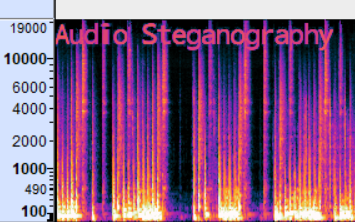

<h1 align="center">
WaveWhisper
</h1>

<p align="center">
<a href="LICENSE"></a>
</p>

<p align="center" style="font-size: 18px;">WaveWhisper is a lightweight Python library for steganographic encryption of text within the spectrogram of an audio file.</p>


<p align="center">

</p>


## Note
This project was originally created for the German competition [*Explore Science Mannheim 2022*](https://www.explore-science.info/downloads/esma2022datensicherheit.pdf) in the category *data security* where it was ranked 2nd. I then made some small changes to turn it into an open source library.


## Installation
To use this library, download the latest [release](https://github.com/maxmmueller/wavewhisper/releases/latest) (source code zip).

In my attempt to make this library as lightweight as possible, it can currently operate without any external dependencies.

## Code example:

```python
from message import Message

message = Message("My secret text")
message.encrypt("song.wav", "encrypted.wav") # carrier path and output path
```

!! FUll DOCS COMING SOON !!


## Contributing
Contributions to this project are welcome!

If you encounter any problems, find a bug or have feature requests, please open an [issue](https://github.com/maxmmueller/wavewhisper/issues/new).


## Support
If you find this project helpful, consider supporting its development by buying me a coffee!

<a href="https://www.buymeacoffee.com/maxmmueller" target="_blank">
  
</a>